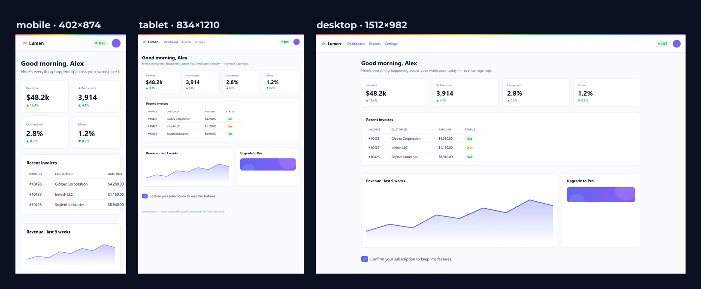
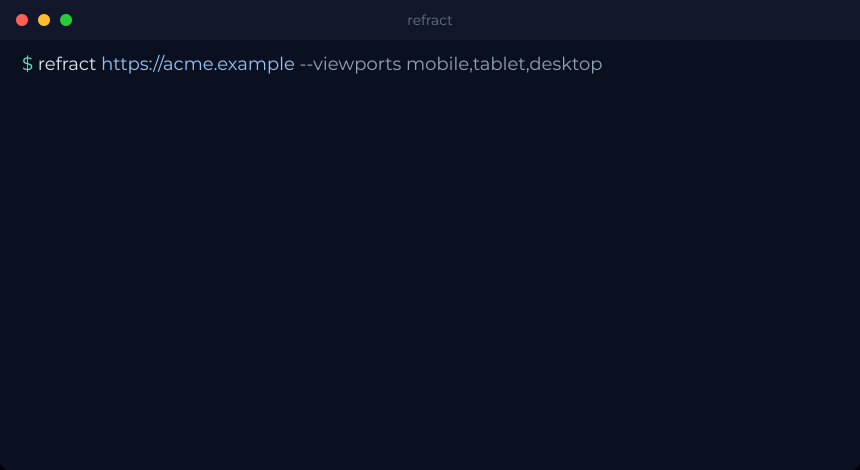

<p align="center">
  
</p>

# Refract

Agent-first responsive screenshots. Give a coding agent (or yourself) one
primitive: *render this URL at N viewports, return the images, and tell me what
visually broke.* Built on Playwright, shipped as an **MCP server + CLI + Node
library**.





> 🚧 **Pre-release.** The engine, CLI, and MCP tool work; npm packages aren't
> published yet, so install from source (`pnpm install && pnpm build`).

## Install

```sh
pnpm add @getrefractjs/core        # library
pnpm add -g @getrefractjs/cli      # CLI
# one-time browser download (deferred until first render):
pnpm exec playwright install chromium
```

## CLI quickstart

```sh
refract https://example.com --viewports mobile,tablet,desktop --out ./shots
```

Outputs `./shots/{preset}.png`, one per viewport, and prints findings under each.
Flags: `--viewports`, `--out`, `--selector`, `--wait-for`, `--wait-for-function`,
`--wait-for-network-idle-ms`, `--freeze`, `--inject-css`, `--dpr`, `--concurrency`,
`--storage-state`, `--engine`.

Use `--inject-css "#clock,.ad{visibility:hidden}"` to hide dynamic or flaky elements
before capture — handy for clean, stable diffs (and the hidden elements stop showing
up as findings too).

When the page is ready only after an app-specific signal, gate the capture with
`--wait-for-function "window.__ready === true"`; for slow pages, raise the
network-idle cap with `--wait-for-network-idle-ms 30000` (it stays best-effort).

Viewports that render identically (e.g. `iphone-17-pro` and `iphone-16-pro` are both
402×874 @3) are rendered **once** and bundled into a single result, with the extra
device names listed as `aliases` — so "render every iPhone" doesn't shoot the same
pixels three times.

## Library quickstart

```ts
import { render } from '@getrefractjs/core';

const shots = await render({ url: 'http://localhost:3000' });
for (const shot of shots) {
  console.log(shot.preset, shot.savedPath);
  for (const f of shot.findings) {
    console.log(`  [${f.severity}] ${f.type} ${f.detail}`);
  }
}
```

## MCP config block

```json
{
  "mcpServers": {
    "refract": {
      "command": "npx",
      "args": ["-y", "@getrefractjs/mcp"]
    }
  }
}
```

The server exposes two tools, each with a description that tells an agent exactly
when and how to call it — no docs required:

- **`render_responsive`** — one call returns a text manifest of absolute saved
  paths, structured findings as JSON (see below), and a downscaled preview image per
  viewport (≤800px wide, so it won't blow the agent's context window); full-resolution
  PNGs are written to disk.
- **`diff_responsive`** — visual regression in-band: renders, compares against a saved
  baseline, and returns a per-viewport status (`unchanged`/`changed`/…) with the % of
  pixels changed, a downscaled diff image for each changed viewport, and a `report.html`
  path. First run with `update: true` to save the baseline, then compare after a change.

Load failures come back as teaching errors the agent can act on.

Working in this repo? A committed `.mcp.json` registers the local server
(`node packages/mcp/dist/index.js`) — run `pnpm build` first and restart your
client so it picks the tool up.

## Authenticated pages

Most real apps live behind a login. Refract renders logged-in pages by reusing a
**Playwright storage-state** file (cookies + localStorage) — the standard format,
nothing Refract-specific. Generate one once by logging in:

```sh
npx playwright codegen --save-storage=auth.json https://your-app.com/login
# log in in the window that opens, then close it
```

Then point any surface at it:

```sh
refract https://your-app.com/dashboard --storage-state ./auth.json
```

```ts
await render({ url: 'https://your-app.com/dashboard', storageState: './auth.json' });
```

```js
render_responsive({ url: 'https://your-app.com/dashboard', storageState: './auth.json' })
```

Already have Playwright auth states from your e2e suite (e.g. `e2e/.auth/*.json`)?
Pass one straight through — no regeneration needed. The file's cookies are sent to
the URL, so don't pair an auth file from one origin with an untrusted URL.

## Findings

Every render returns structured findings per viewport **alongside** the
screenshots — agents act on these instead of eyeballing pixels:

```ts
{ preset: "mobile", findings: [
  { type: "horizontal_overflow", severity: "error", detail: "scrollWidth=480 viewport=402",
    selector: "div.card", rect: { x: 0, y: 120, width: 480, height: 90 } },
  { type: "tap_target_small", severity: "warn", selector: "button#tiny-btn", size: "28x24",
    rect: { x: 16, y: 540, width: 28, height: 24 } },
]}
```

Most findings carry a `selector` and a `rect` (the culprit's box in document pixels, so you
can zoom straight to what broke); `horizontal_overflow` names the element that causes it.

| type | severity | fires when |
|---|---|---|
| `horizontal_overflow` | error | the page scrolls wider than the viewport (names the culprit element) |
| `element_clipped` | warn | an element sticks out past the viewport edge |
| `text_overflow` | warn | text is hard-clipped with no ellipsis (`scrollWidth > clientWidth`; intentional `text-overflow: ellipsis` truncation is ignored) |
| `tap_target_small` | warn | an interactive element is under 44×44 (mobile viewports) |
| `image_no_alt` | warn | an `` is missing its `alt` attribute |

The CLI prints them under each shot; the MCP tool returns them as JSON keyed by preset.

### Token footprint

Findings-first responses and downscaled previews aren't just nice-to-haves — they
keep the agent's context window alive. Measured on the demo-site (3 viewports), one
`render_responsive` response costs roughly:

| response shape | Claude | GPT-4o | Gemini |
|---|---|---|---|
| findings only (no images) | ~620 | ~620 | ~620 |
| **downscaled previews** (default) | **~4.2k** | ~4.0k | ~3.7k |
| full-resolution images (naive) | ~17.7k | ~4.3k | ~8.9k |

So Refract's default is **~76% smaller than dumping full-res screenshots** on Claude,
and the structured findings alone are a few hundred tokens. Re-run anytime with
`pnpm bench`; details + per-model formulas in [benchmarks/RESULTS.md](benchmarks/RESULTS.md).

## Visual diff

`refract diff` catches *unintended* visual change across viewports — the "did my
CSS tweak break another page" check. Baselines are just PNGs in a folder, so it's
git-agnostic and trivial to wire into CI.

```sh
# 1. Save a baseline (once, or to accept new changes)
refract diff https://example.com --update          # writes ./refract-baseline/{preset}.png

# 2. Later, compare a fresh render against it
refract diff https://example.com                   # exits 1 if anything changed
```

Each viewport is compared with [`pixelmatch`](https://github.com/mapbox/pixelmatch).
Output per preset is `unchanged`, `changed` (with the % of pixels and a
`{preset}.diff.png` highlighting them), `size_changed`, or `no_baseline`. Alongside the
pixel diff, each preset reports a **findings delta** — which findings were *fixed* (gone
since the baseline) or *regressed* (new) — so you can confirm a fix landed without
introducing a new responsive issue. (The `--update` snapshot stores the findings too, in
`findings.json`; an older baseline without one just omits the delta.) A
`report.html` lands next to the shots with a **baseline │ current │ diff** grid.
The command **exits non-zero when anything changed**, so CI fails on a regression;
re-run with `--update` to accept the new look as the baseline. Flags: `--baseline
<dir>`, `--update`, `--threshold <0-1>`, plus all the render flags above (`--freeze`
is recommended for deterministic diffs).

### Use in CI

Commit your baselines (`./refract-baseline/`) and run `refract diff` against a
deployed preview on every PR — it exits non-zero on a regression, failing the job.
A ready-to-copy GitHub Actions workflow is in
[examples/github-actions/visual-diff.yml](examples/github-actions/visual-diff.yml):
it installs the CLI + Chromium, runs the diff, and uploads `report.html` + the diff
PNGs as an artifact when something changed. Refresh baselines by re-running with
`--update` and committing. (Agents working in an MCP client can do the same loop via
the `diff_responsive` tool.)

## What this is *not*

- ❌ A browser extension or live-preview app (that's Responsively's job).
- ❌ A general-purpose browser-control MCP (that's `playwright-mcp`'s job). It
  renders URLs at viewports; it cannot click, type, or perform a login flow. It
  *can* reuse a saved auth state (`--storage-state`) to render a logged-in page,
  but it won't log in for you.
- ❌ A visual-regression engine reinvented from scratch (it wraps `pixelmatch`).
- ❌ A real-device cloud. Playwright **emulates** viewport, DPR, UA, and touch, and
  `--engine webkit` runs the **real WebKit engine** (close to iOS Safari) — but it's
  still desktop WebKit, not an actual iOS device or GPU. It does not replace BrowserStack.

## Cross-browser

Renders on **Chromium by default**; pass `--engine webkit` (or `engine: "webkit"` in the
library / MCP) to render with the **real Safari/WebKit engine** — the closest local proxy
to iOS Safari, where a lot of responsive bugs actually show up.

```sh
npx playwright install webkit          # one-time, ~70MB
refract https://example.com --engine webkit
```

It works everywhere a render does (CLI, library, MCP `render_responsive` / `diff_responsive`).
For visual diffs, keep a separate baseline dir per engine (`--baseline ./baseline-webkit`)
since engines render slightly differently. Firefox isn't supported yet (it can't emulate
`isMobile` and ignores DPR) — open an issue if you need it.

## Roadmap

Where Refract is headed — deeper findings, shareable reports, more device/engine coverage —
is in [docs/ROADMAP.md](docs/ROADMAP.md). It's directional, not a promise; real usage steers it.

## Security

Refract loads **any URL you give it** — including `file://` (local files) and
internal/private hosts (e.g. cloud metadata endpoints) — and returns the rendered
pixels. Treat it like `curl`: don't point it, or an agent driving the MCP server,
at untrusted or sensitive URLs. There is no URL allow/deny list by default. See
[SECURITY.md](SECURITY.md) to report a vulnerability.

## License

MIT
